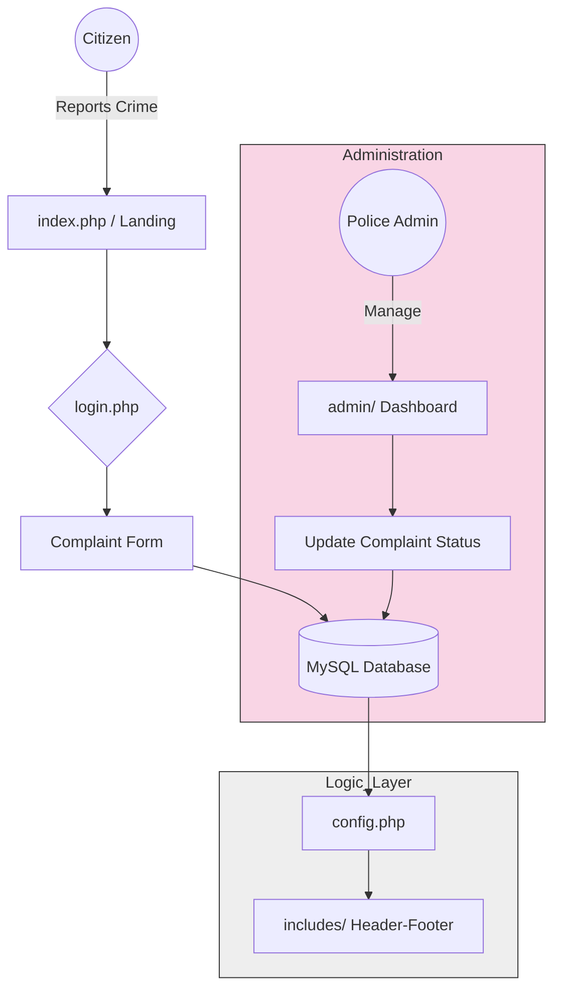

# 🛡️ Jan Suraksha - Online Crime Reporting Portal


## 📚 Table of Contents

- [📖 About The Project](#-about-the-project)
- [🌟 Why this project?](#-why-this-project)
- [🔗 Live Demo](#-live-demo)
- [🚀 Tech Stack](#-tech-stack)
- [📂 Project Architecture](#-project-architecture)
- [✨ Key Compatibilities](#-key-compatibilities)
- [📸 Screenshots](#-screenshots)
- [🛠️ Getting Started (Installation)](#️-getting-started-installation)
  - [Prerequisites](#prerequisites)
  - [Step-by-Step Installation](#step-by-step-installation)
- [🤝 Contribution Guidelines](#-contribution-guidelines)
- [🧑‍💻 Contributors](#-contributors)
- [🛡️ Project Admin](#️-project-admin)
- [📄 License](#-license)
- [Thanks for visiting Jan Suraksha! 🇮🇳](#thanks-for-visiting-jan-suraksha-️)

-----

## 📖 About The Project

**Jan Suraksha** is a digital initiative aimed at bridging the gap between citizens and law enforcement. It is an online crime reporting portal designed to make the process of reporting incidents safer, faster, and more transparent.

In many scenarios, citizens hesitate to report crimes due to fear or procedural complexities. Jan Suraksha aims to solve this by providing a user-friendly platform where complaints can be lodged securely.

### 🌟 Why this project?
* **Safety:** Encourages citizens to report crimes without fear.
* **Transparency:** Real-time tracking of complaint status.
* **Social Impact:** Directly contributes to a safer society using technology.

-----

## 🔗 Live Demo
Check out the live project here:  
👉 **https://jansuraksha.infinityfreeapp.com/**

-----

## 🚀 Tech Stack

This project is built using the following technologies:

* **Frontend:** HTML5, CSS3, JavaScript, Bootstrap (Responsive Design)
* **Backend:** PHP (Core)
* **Database:** MySQL
* **Server Environment:** XAMPP / WAMP (Apache Server)
* **DevOps:** GitHub Actions (Automated Deployment)

-----

## 📂 Project Architecture

Understanding the codebase is easy! Here is how our files are organized:
```text
Jan-Suraksha/
├── admin/               # Admin dashboard & status management
├── assets/              # UI Assets: CSS, JS, and Banner Images
├── includes/            # Reusable PHP modules (Header/Footer/Nav)
├── config.php           # Database connection & Environment config
├── schema.sql           # Database structure for SQL import
├── index.php            # Main Landing Page
└── login.php            # User authentication logic
```

### System Architecture
To help contributors understand the PHP-MySQL request lifecycle, here is the high-level architecture:

<div align="center">


</div>

-----

## ✨ Key Capabilities

| Feature | Description | Status |
| :--- | :--- | :--- |
| **Citizen Reporting** | Secure form to report incidents (Theft, Cybercrime, etc.) | ✅ Completed |
| **Real-time Tracking** | Check status updates from law enforcement in real-time | ✅ Completed |
| **Admin Dashboard** | Exclusive panel for police to manage cases | ✅ Completed |
| **Multilingual Support**| Support for regional language reporting | 🛠️ In Progress |
| **Mobile Responsive** | Fully functional on smartphones and tablets | ✅ Completed |

-----

## 📸 Screenshots

| Home Page | Complaint Form |
| :---: | :---: |
|  |  |
|  |  |
| |  |

-----

> [!WARNING]
> **Important: Admin Credentials** > For testing the administrative side, use:  
> **Username:** `admin` | **Password:** `admin`

## 🛠️ Getting Started (Installation)

Follow these steps to set up the project locally on your machine.

### Prerequisites

You need a local server environment to run PHP and MySQL.

  * [XAMPP](https://www.apachefriends.org/index.html) (Recommended for Windows/Linux/Mac)
  * OR [WAMP](http://www.wampserver.com/en/) (For Windows)
  * A Code Editor (VS Code recommended)

### Step-by-Step Installation

1.  **Install XAMPP:** Download and install XAMPP. Start the **Apache** and **MySQL** modules from the XAMPP Control Panel.
2.  **Fork & Clone the Repository:**
      * Navigate to your XAMPP installation folder (usually `C:\xampp\htdocs`).
      * Open your terminal/git bash in the `htdocs` folder.
      * Clone the repo:
    ```
    git clone [https://github.com/your-username/jan_suraksha.git]
    ```
3.  **Database Configuration:**
      * Open your browser and go to `http://localhost/phpmyadmin`.
      * Create a new database named **`jan_suraksha`** (Make sure this name matches your code).
      * Click on the **Import** tab.
      * Choose the **`schema.sql`** file provided in this repository and click **Go**.
4.  **Connect Database:**
      * Go to the project folder -> Open the `config.php` file.
      * Ensure the credentials match your local setup (Default XAMPP user is `root` with no password).
    ```
    $db_host = 'localhost';
    $db_user = 'root';
    $db_pass = ''; 
    $db_name = 'jan_suraksha';
    ```
> [!CAUTION]
> **Security Note:** Never commit your local config.php if it contains sensitive credentials. This file is ignored by Git in production to prevent data leaks.
5.  **Run the Project:**
      * Open your browser.
      * Go to: `http://localhost/jan_suraksha/jan_suraksha`

#### Additional Notes (using Docker):
In case you're you want to use docker to run mysql instance.

```shell
    docker-compose up db -d
```

#### Update values in the `config.php` file.

```shell
    $db_host = '127.0.0.1';
    $db_user = 'root';
    $db_pass = 'root';
    $db_name = 'jan_suraksha';
```

-----

## 🤝 Contribution Guidelines 

We welcome contributions from everyone!

### How to Contribute?

1.  **Find an Issue:** Look for issues tagged with  `good first issue`, `bug`, or `enhancement`.
2.  **Assign Yourself:** Comment on the issue asking to be assigned. **Do not start working until assigned.**
3.  **Fork the Repo:** Click the "Fork" button on the top right.
4.  **Create a Branch:**
    ```
    git checkout -b feature-name
    ```
5.  **Make Changes & Commit:**
      * Keep code clean and commented.
    ```
    git commit -m "Fixed bug in login page"
    ```
6.  **Push Changes:**
    ```
    git push origin feature-name
    ```
7.  **Create a Pull Request (PR):** Go to the original repository and click "Compare & pull request".

> **⚠️ IMPORTANT:** Do **NOT** change the `config.php` file in your PR unless necessary for local testing. Our CI/CD pipeline handles the live server connection automatically.

-----

## 🧑‍💻 Contributors

A huge thank you to all the amazing people who have contributed to **Jan Suraksha**!

<a href="https://github.com/Anjalijagta/jan_suraksha/graphs/contributors">
  
</a>


**Want to contribute?** Follow our [Contribution Guidelines](#-contribution-guidelines) — all PRs welcome! 🚀

-----

## 🛡️ Project Admin

  * **Anjali Jagtap** - *Project Lead* - [https://github.com/Anjalijagta](https://github.com/Anjalijagta)

-----

## 📄 License

This project is licensed under the [MIT License](https://www.google.com/search?q=LICENSE).


-----

## Thanks for visiting Jan Suraksha! 🇮🇳
## Making society safer, one line of code at a time.
